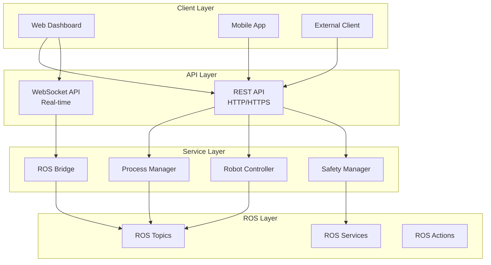

# 📚 API Reference

Complete API documentation for the Kinova Robot Control System.

## 📡 Overview

The system provides both HTTP REST APIs and WebSocket APIs for controlling the robot and managing system processes.

### API Architecture



## 🌐 REST API Endpoints

### Base URL
```
http://localhost:3000/api
```

### Authentication
Currently, the system runs in development mode without authentication. For production deployments, implement proper authentication.

---

## 🔧 Process Management API

### GET `/api/processes`

Get status of all ROS processes.

#### Request

```http
GET /api/processes
Content-Type: application/json
```

#### Response

```json
{
  "success": true,
  "processes": {
    "roscore": {
      "name": "ROS Core",
      "status": "running",
      "pid": 12345,
      "uptime": "00:05:23",
      "memory": "45.2 MB",
      "cpu": "2.1%"
    },
    "kortex_driver": {
      "name": "Kortex Driver",
      "status": "running",
      "pid": 12346,
      "uptime": "00:04:15",
      "memory": "123.5 MB",
      "cpu": "5.7%"
    },
    "rosbridge": {
      "name": "ROS Bridge",
      "status": "stopped",
      "pid": null,
      "uptime": null,
      "memory": null,
      "cpu": null
    }
  },
  "summary": {
    "total": 8,
    "running": 2,
    "stopped": 6,
    "system_load": "1.25"
  }
}
```

#### Status Codes

- `200 OK` - Successfully retrieved process status
- `500 Internal Server Error` - System error

### POST `/api/processes`

Start or stop ROS processes.

#### Request

```http
POST /api/processes
Content-Type: application/json

{
  "action": "start|stop|restart",
  "process": "process_name",
  "options": {
    "force": false,
    "timeout": 30
  }
}
```

#### Parameters

| Parameter | Type | Required | Description |
|-----------|------|----------|-------------|
| `action` | string | Yes | Action to perform: `start`, `stop`, or `restart` |
| `process` | string | Yes | Process name (see available processes) |
| `options.force` | boolean | No | Force kill process if stopping |
| `options.timeout` | number | No | Timeout in seconds |

#### Available Processes

- `roscore` - ROS Master
- `kortex_driver` - Robot driver
- `rosbridge` - WebSocket bridge
- `servo_server` - MoveIt servo
- `velocity_bridge` - Message converter
- `joystick_controller` - Manual control
- `kinova_vision` - Camera system
- `rviz` - Visualization tool

#### Response

```json
{
  "success": true,
  "message": "Process kortex_driver started successfully",
  "process": {
    "name": "kortex_driver",
    "status": "running",
    "pid": 12350,
    "command": "roslaunch kortex_driver kortex_driver.launch"
  }
}
```

#### Status Codes

- `200 OK` - Action completed successfully
- `400 Bad Request` - Invalid parameters
- `404 Not Found` - Process not found
- `500 Internal Server Error` - Action failed

#### Example Usage

```javascript
// Start robot driver
const response = await fetch('/api/processes', {
  method: 'POST',
  headers: {
    'Content-Type': 'application/json',
  },
  body: JSON.stringify({
    action: 'start',
    process: 'kortex_driver'
  })
});

const result = await response.json();
console.log(result);
```

---

## 🤖 Robot Control API

### POST `/api/robot/command`

Send movement commands to the robot.

#### Request

```http
POST /api/robot/command
Content-Type: application/json

{
  "type": "twist|joint|position",
  "command": {
    // Command data based on type
  },
  "options": {
    "frame": "base_link",
    "timeout": 1.0
  }
}
```

#### Twist Command (Cartesian Velocity)

```json
{
  "type": "twist",
  "command": {
    "linear": {
      "x": 0.1,
      "y": 0.0,
      "z": 0.0
    },
    "angular": {
      "x": 0.0,
      "y": 0.0,
      "z": 0.2
    }
  },
  "options": {
    "frame": "base_link"
  }
}
```

#### Joint Command (Joint Velocities)

```json
{
  "type": "joint",
  "command": {
    "velocities": [0.1, 0.0, -0.05, 0.0, 0.0, 0.0, 0.0]
  }
}
```

#### Position Command (Joint Positions)

```json
{
  "type": "position",
  "command": {
    "positions": [0.0, 0.5, 1.57, 0.0, 1.0, 0.0, 0.0]
  },
  "options": {
    "speed": 0.5,
    "acceleration": 0.3
  }
}
```

#### Response

```json
{
  "success": true,
  "message": "Command sent successfully",
  "command_id": "cmd_1234567890",
  "timestamp": "2024-01-15T10:30:00Z"
}
```

#### Status Codes

- `200 OK` - Command sent successfully
- `400 Bad Request` - Invalid command format
- `503 Service Unavailable` - Robot not connected
- `429 Too Many Requests` - Rate limit exceeded

### GET `/api/robot/status`

Get current robot status and joint states.

#### Request

```http
GET /api/robot/status
```

#### Response

```json
{
  "success": true,
  "robot": {
    "connected": true,
    "status": "ready",
    "mode": "normal",
    "emergency_stopped": false,
    "joint_states": {
      "positions": [0.1, 0.5, 1.2, 0.0, 0.8, 0.0, 0.0],
      "velocities": [0.0, 0.0, 0.0, 0.0, 0.0, 0.0, 0.0],
      "efforts": [0.1, 0.2, 0.1, 0.0, 0.1, 0.0, 0.0],
      "names": ["joint_1", "joint_2", "joint_3", "joint_4", "joint_5", "joint_6", "joint_7"]
    },
    "pose": {
      "position": {
        "x": 0.5,
        "y": 0.0,
        "z": 0.3
      },
      "orientation": {
        "x": 0.0,
        "y": 0.0,
        "z": 0.0,
        "w": 1.0
      }
    },
    "gripper": {
      "position": 0.5,
      "status": "moving"
    }
  },
  "timestamp": "2024-01-15T10:30:00Z"
}
```

### POST `/api/robot/gripper`

Control the robot gripper.

#### Request

```http
POST /api/robot/gripper
Content-Type: application/json

{
  "action": "open|close|move",
  "position": 0.0,  // 0.0 = fully open, 1.0 = fully closed
  "speed": 0.5,     // 0.0 to 1.0
  "force": 0.8      // 0.0 to 1.0
}
```

#### Response

```json
{
  "success": true,
  "message": "Gripper command sent",
  "gripper": {
    "position": 0.0,
    "speed": 0.5,
    "force": 0.8,
    "status": "moving"
  }
}
```

---

## 🛡️ Safety API

### POST `/api/safety/emergency-stop`

Trigger or reset emergency stop.

#### Request

```http
POST /api/safety/emergency-stop
Content-Type: application/json

{
  "action": "trigger|reset"
}
```

#### Response

```json
{
  "success": true,
  "message": "Emergency stop triggered",
  "safety_status": {
    "emergency_stopped": true,
    "timestamp": "2024-01-15T10:30:00Z",
    "reason": "user_triggered"
  }
}
```

### GET `/api/safety/status`

Get current safety system status.

#### Response

```json
{
  "success": true,
  "safety": {
    "emergency_stopped": false,
    "joint_limits_active": true,
    "collision_detection": true,
    "safety_zones": [
      {
        "name": "workspace_boundary",
        "active": true,
        "violated": false
      }
    ],
    "last_incident": null
  }
}
```

---

## 📡 ROS Topics API

### GET `/api/ros/topics`

List all active ROS topics.

#### Response

```json
{
  "success": true,
  "topics": [
    {
      "name": "/my_gen3/joint_states",
      "type": "sensor_msgs/JointState",
      "publishers": 1,
      "subscribers": 3,
      "frequency": 100
    },
    {
      "name": "/servo_server/delta_twist_cmds",
      "type": "geometry_msgs/TwistStamped",
      "publishers": 2,
      "subscribers": 1,
      "frequency": 50
    }
  ],
  "total_topics": 47
}
```

### POST `/api/ros/topics`

Publish to a ROS topic.

#### Request

```http
POST /api/ros/topics
Content-Type: application/json

{
  "topic": "/servo_server/delta_twist_cmds",
  "message_type": "geometry_msgs/TwistStamped",
  "message": {
    "header": {
      "stamp": "now",
      "frame_id": "base_link"
    },
    "twist": {
      "linear": {"x": 0.1, "y": 0.0, "z": 0.0},
      "angular": {"x": 0.0, "y": 0.0, "z": 0.0}
    }
  }
}
```

---

## 🔌 WebSocket API

### Connection

Connect to the WebSocket server for real-time communication:

```javascript
const ws = new WebSocket('ws://localhost:9090');

ws.onopen = function(event) {
    console.log('Connected to ROS Bridge');
    
    // Subscribe to topics
    const subscribeMsg = {
        op: 'subscribe',
        topic: '/my_gen3/joint_states',
        type: 'sensor_msgs/JointState'
    };
    ws.send(JSON.stringify(subscribeMsg));
};

ws.onmessage = function(event) {
    const data = JSON.parse(event.data);
    console.log('Received:', data);
};
```

### WebSocket Message Types

#### Subscribe to Topic

```json
{
  "op": "subscribe",
  "topic": "/my_gen3/joint_states",
  "type": "sensor_msgs/JointState",
  "throttle_rate": 100,
  "queue_length": 1
}
```

#### Unsubscribe from Topic

```json
{
  "op": "unsubscribe",
  "topic": "/my_gen3/joint_states"
}
```

#### Publish to Topic

```json
{
  "op": "publish",
  "topic": "/servo_server/delta_twist_cmds",
  "msg": {
    "header": {
      "stamp": {"secs": 0, "nsecs": 0},
      "frame_id": "base_link"
    },
    "twist": {
      "linear": {"x": 0.1, "y": 0.0, "z": 0.0},
      "angular": {"x": 0.0, "y": 0.0, "z": 0.0}
    }
  }
}
```

#### Call Service

```json
{
  "op": "call_service",
  "service": "/my_gen3/base/clear_faults",
  "args": {}
}
```

---

## 📊 Status Monitoring

### Real-time Data Streams

The system provides several real-time data streams via WebSocket:

#### Joint States Stream
- **Topic**: `/my_gen3/joint_states`
- **Type**: `sensor_msgs/JointState`
- **Frequency**: ~100Hz
- **Data**: Joint positions, velocities, efforts

#### Robot Feedback Stream  
- **Topic**: `/my_gen3/base_feedback`
- **Type**: `kortex_driver/BaseCyclic_Feedback`
- **Frequency**: ~1000Hz
- **Data**: Detailed robot state information

#### Servo Status Stream
- **Topic**: `/servo_server/status`
- **Type**: `std_msgs/Int8`
- **Frequency**: ~10Hz
- **Data**: Servo system status codes

### Status Codes

#### Servo Status Codes
- `0` - HALTED
- `1` - PLANNING
- `2` - EXECUTION  
- `3` - MONITORING
- `4` - EMERGENCY_STOP

#### Robot Status Codes
- `0` - UNSPECIFIED
- `1` - BOOTING
- `2` - CALIBRATING
- `3` - READY
- `4` - ERROR
- `5` - EMERGENCY_STOP

---

## 🔨 SDK and Client Libraries

### JavaScript/TypeScript Client

```typescript
// Install the client library
npm install @kinovarobot/web-client

// Usage example
import { KinovaRobotClient } from '@kinovarobot/web-client';

const client = new KinovaRobotClient({
  apiUrl: 'http://localhost:3000/api',
  wsUrl: 'ws://localhost:9090'
});

// Connect and start monitoring
await client.connect();

// Send twist command
await client.robot.sendTwistCommand({
  linear: { x: 0.1, y: 0.0, z: 0.0 },
  angular: { x: 0.0, y: 0.0, z: 0.0 }
});

// Subscribe to joint states
client.robot.onJointStates((jointStates) => {
  console.log('Joint positions:', jointStates.position);
});
```

### Python Client

```python
# Install the client library
pip install kinova-robot-client

# Usage example
from kinova_robot_client import KinovaRobotClient

client = KinovaRobotClient(
    api_url='http://localhost:3000/api',
    ws_url='ws://localhost:9090'
)

# Connect to robot
client.connect()

# Send joint command
client.robot.send_joint_velocities([0.1, 0.0, 0.0, 0.0, 0.0, 0.0, 0.0])

# Get robot status
status = client.robot.get_status()
print(f"Robot status: {status['status']}")

# Subscribe to topics
def joint_callback(msg):
    print(f"Joint positions: {msg['position']}")

client.ros.subscribe('/my_gen3/joint_states', joint_callback)
```

---

## 🚨 Error Handling

### HTTP Error Responses

All API endpoints return consistent error responses:

```json
{
  "success": false,
  "error": {
    "code": "ROBOT_NOT_CONNECTED",
    "message": "Robot is not connected",
    "details": {
      "suggestion": "Check robot connection and try again",
      "documentation": "https://docs.example.com/robot-connection"
    }
  },
  "timestamp": "2024-01-15T10:30:00Z"
}
```

### Common Error Codes

| Code | Description | HTTP Status |
|------|-------------|-------------|
| `ROBOT_NOT_CONNECTED` | Robot is not connected | 503 |
| `INVALID_COMMAND` | Command format is invalid | 400 |
| `SAFETY_VIOLATION` | Command violates safety constraints | 403 |
| `RATE_LIMIT_EXCEEDED` | Too many requests | 429 |
| `PROCESS_NOT_FOUND` | ROS process not found | 404 |
| `INTERNAL_ERROR` | Unexpected server error | 500 |

### WebSocket Error Messages

```json
{
  "op": "status",
  "level": "error",
  "msg": "Failed to subscribe to topic /invalid_topic: Topic does not exist"
}
```

---

## 📈 Rate Limits

To ensure system stability, the following rate limits are enforced:

| Endpoint | Rate Limit | Window |
|----------|------------|---------|
| `/api/robot/command` | 50 requests | 1 second |
| `/api/processes` | 10 requests | 1 minute |
| `/api/safety/emergency-stop` | 5 requests | 1 minute |
| WebSocket messages | 100 messages | 1 second |

---

## 🧪 Testing the API

### Using curl

```bash
# Get process status
curl -X GET http://localhost:3000/api/processes

# Start robot driver
curl -X POST http://localhost:3000/api/processes \
  -H "Content-Type: application/json" \
  -d '{"action": "start", "process": "kortex_driver"}'

# Send robot command
curl -X POST http://localhost:3000/api/robot/command \
  -H "Content-Type: application/json" \
  -d '{
    "type": "twist",
    "command": {
      "linear": {"x": 0.1, "y": 0.0, "z": 0.0},
      "angular": {"x": 0.0, "y": 0.0, "z": 0.0}
    }
  }'
```

### Using Postman

Import the Postman collection:

```json
{
  "info": {
    "name": "Kinova Robot Control API",
    "schema": "https://schema.getpostman.com/json/collection/v2.1.0/collection.json"
  },
  "item": [
    {
      "name": "Get Process Status",
      "request": {
        "method": "GET",
        "header": [],
        "url": {
          "raw": "http://localhost:3000/api/processes",
          "protocol": "http",
          "host": ["localhost"],
          "port": "3000",
          "path": ["api", "processes"]
        }
      }
    }
  ]
}
```

---

## 📝 Changelog

### Version 1.0.0
- Initial API release
- Basic robot control endpoints
- Process management API
- WebSocket integration

### Version 1.1.0
- Added safety API endpoints
- Enhanced error handling
- Rate limiting implementation
- Client library support

---

**🔒 Security Note**: This API is designed for development and testing. For production use, implement proper authentication, HTTPS, input validation, and other security measures.

**📞 Support**: For API questions or issues, please check the [GitHub repository](https://github.com/Team-Deimos-IIT-Mandi/Robotic-Arm-Gui/issues) or refer to the [troubleshooting guide](./TROUBLESHOOTING.md).