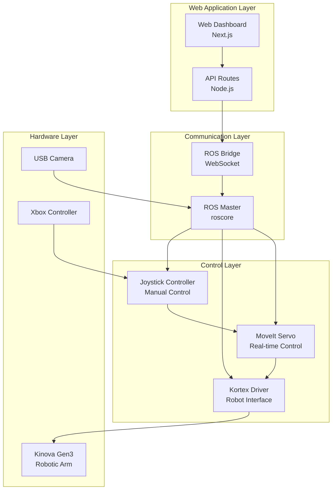
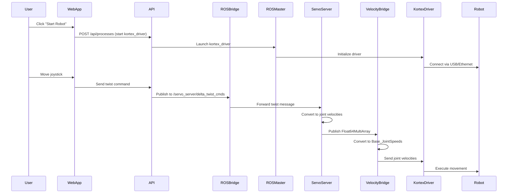
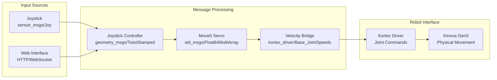
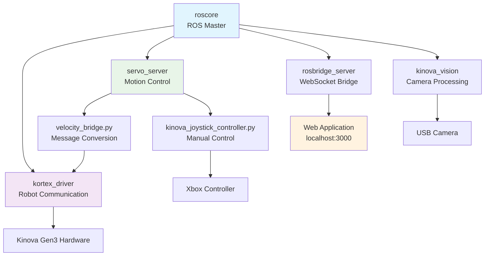

# Kinova Robot Control System

A comprehensive web-based control system for Kinova robotic arms using ROS1, Next.js, and real-time WebSocket communication. This system provides both manual joystick control and web-based interface for robot operation.

## 🤖 Features

- **Web-based Dashboard**: Modern React/Next.js interface for robot control
- **ROS1 Integration**: Full ROS ecosystem integration with WebSocket bridge
- **Joystick Control**: Xbox controller support for manual robot operation
- **MoveIt Servo**: Real-time servo control with collision detection
- **Process Management**: Start/stop ROS processes from web interface
- **Safety Systems**: Emergency stop and safety monitoring
- **Vision Integration**: Camera feed and image processing
- **Real-time Monitoring**: Live robot status and joint state feedback

## 📋 Prerequisites

- **Operating System**: Ubuntu 20.04.6 LTS
- **ROS Version**: ROS Noetic
- **Hardware**: Kinova Gen3 robotic arm
- **Controller**: Xbox controller (optional, for manual control)
- **Node.js**: Version 18 or higher
- **Python**: 3.8+

## 🛠 Installation

### 1. System Dependencies

```bash
# Update system packages
sudo apt update && sudo apt upgrade -y

# Install ROS Noetic (if not already installed)
sudo sh -c 'echo "deb http://packages.ros.org/ros/ubuntu $(lsb_release -sc) main" > /etc/apt/sources.list.d/ros-latest.list'
sudo apt install curl -y
curl -s https://raw.githubusercontent.com/ros/rosdistro/master/ros.asc | sudo apt-key add -
sudo apt update
sudo apt install ros-noetic-desktop-full -y

# Install additional ROS packages
sudo apt install -y \
  ros-noetic-rosbridge-suite \
  ros-noetic-usb-cam \
  ros-noetic-moveit \
  ros-noetic-moveit-servo \
  ros-noetic-joint-state-publisher \
  ros-noetic-robot-state-publisher \
  ros-noetic-rqt-image-view \
  python3-rosdep \
  python3-rosinstall \
  python3-rosinstall-generator \
  python3-wstool \
  build-essential

# Initialize rosdep
sudo rosdep init
rosdep update
```

### 2. Clone and Setup Repository

```bash
# Clone the project
git clone https://github.com/Team-Deimos-IIT-Mandi/Robotic-Arm-Gui
cd my_main_project

# Setup ROS workspace
source /opt/ros/noetic/setup.bash
cd ros_ws
catkin_make
source devel/setup.bash
```

### 3. Install Node.js Dependencies

```bash
# Navigate to web application
cd ../my-app

# Install dependencies
npm install

# Build the application
npm run build
```

### 4. Hardware Setup

1. Connect your Kinova Gen3 arm via USB or Ethernet
2. Connect Xbox controller (optional)
3. Connect USB camera (optional)

### 5. ROS Environment Configuration

```bash
# Add to ~/.bashrc for permanent setup
echo "source /opt/ros/noetic/setup.bash" >> ~/.bashrc
echo "source /root/my_main_project/ros_ws/devel/setup.bash" >> ~/.bashrc
echo "export ROS_MASTER_URI=http://localhost:11311" >> ~/.bashrc
echo "export ROS_IP=$(hostname -I | awk '{print $1}')" >> ~/.bashrc

# Reload bash configuration
source ~/.bashrc
```

## 🚀 Quick Start

### Method 1: Automated Setup (Recommended)

```bash
# Run the setup script
cd /root/my_main_project/my-app/scripts
python3 setup-ros-environment.py

# Start the web application
cd ../
npm run dev
```

### Method 2: Manual Setup

```bash
# Terminal 1: Start ROS Core
roscore

# Terminal 2: Start Kinova Driver
roslaunch kortex_driver kortex_driver.launch

# Terminal 3: Start ROS Bridge
roslaunch rosbridge_server rosbridge_websocket.launch port:=9090

# Terminal 4: Start Web Application
cd /root/my_main_project/my-app
npm run dev

# Terminal 5: Start Joystick Control (Optional)
cd /root/ros_ws
source devel/setup.bash
python3 src/niwesh/kinova_urc_arm/kortex_examples/scripts/kinova_joystick_controller.py
```

### Access the Application

- **Web Interface**: http://localhost:3000
- **ROS Bridge**: ws://localhost:9090
- **ROS Master**: http://localhost:11311

## 🎮 Usage

### Web Dashboard

1. Open http://localhost:3000
2. Use the **Master Controls** to start all systems
3. Monitor individual process status in the **Process Management Grid**
4. Control the robot using the **Kinova Robot Control** panel
5. View logs in the **Logs** tab

### Joystick Control

1. Connect Xbox controller
2. Start the joystick control process
3. Use controller for manual robot operation:
   - **A Button**: Toggle Translation/Rotation mode
   - **B Button**: Emergency stop
   - **Left Stick**: Move X/Y (translation) 
   - **Right Stick**: Pitch/Yaw (rotation)
   - **Triggers**: Z movement (translation) / Roll (rotation)
   - **LB/RB**: Gripper open/close

## 📊 System Architecture

### High-Level Architecture



### Detailed Control Flow



### Message Flow Diagram



### Process Dependencies



## 🔧 Configuration

### Servo Configuration

Key parameters in `/ros_ws/src/.../config/servo_config.yaml`:

```yaml
# Velocity scaling (adjust for speed)
scale:
  linear: 0.5     # Linear movement speed
  rotational: 0.6 # Rotational movement speed
  joint: 0.6      # Joint-level speed

# Safety limits
joint_limits:
  max_velocity: 1.2  # Maximum joint velocity (rad/s)

# Communication
command_out_topic: /servo_server/command
cartesian_command_in_topic: /servo_server/delta_twist_cmds
```

### Web Application Configuration

Environment variables in `/my-app/.env.local`:

```env
ROS_BRIDGE_URL=ws://localhost:9090
ROS_MASTER_URI=http://localhost:11311
NEXT_PUBLIC_API_URL=http://localhost:3000/api
```

## 🐛 Troubleshooting

### Common Issues

1. **ROS Master not found**
   ```bash
   # Check if roscore is running
   ps aux | grep roscore
   # If not running:
   roscore &
   ```

2. **Robot not responding**
   ```bash
   # Check robot connection
   rostopic echo /my_gen3/joint_states -n 1
   # Restart driver if needed
   roslaunch kortex_driver kortex_driver.launch
   ```

3. **Servo not moving robot**
   ```bash
   # Check servo status
   rostopic echo /servo_server/status
   # Check velocity bridge
   rostopic echo /my_gen3/in/joint_velocity
   ```

4. **Web interface not connecting**
   ```bash
   # Check ROS bridge
   rostopic list | grep -i bridge
   # Restart if needed
   roslaunch rosbridge_server rosbridge_websocket.launch port:=9090
   ```

### Debug Commands

```bash
# Check all ROS topics
rostopic list

# Monitor joint states
rostopic echo /my_gen3/joint_states

# Check servo output
rostopic echo /servo_server/command

# Monitor robot velocity commands
rostopic echo /my_gen3/in/joint_velocity

# Check system processes
ps aux | grep ros
```

## 📁 Project Structure

```
my_main_project/
├── my-app/                          # Next.js Web Application
│   ├── app/
│   │   ├── api/                     # API Routes
│   │   │   ├── processes/           # Process management
│   │   │   ├── robot/               # Robot commands
│   │   │   └── safety/              # Safety systems
│   │   └── page.tsx                 # Main dashboard
│   ├── components/
│   │   ├── kinova/                  # Robot-specific components
│   │   └── ui/                      # UI components
│   ├── lib/
│   │   └── rosbridge.ts            # ROS WebSocket client
│   └── scripts/
│       └── setup-ros-environment.py # Setup automation
└── ros_ws/                          # ROS Workspace
    └── src/
        └── niwesh/
            └── kinova_urc_arm/
                └── kortex_examples/
                    ├── config/      # Configuration files
                    ├── launch/      # Launch files
                    └── scripts/     # Control scripts
```

## 🤝 Contributing

1. Fork the repository
2. Create a feature branch (`git checkout -b feature/amazing-feature`)
3. Commit your changes (`git commit -m 'Add amazing feature'`)
4. Push to the branch (`git push origin feature/amazing-feature`)
5. Open a Pull Request

## 📝 License

This project is licensed under the MIT License - see the [LICENSE](LICENSE) file for details.

## 🙏 Acknowledgments

- [Kinova Robotics](https://www.kinovarobotics.com/) for the robot hardware and drivers
- [ROS Community](https://www.ros.org/) for the robotics framework
- [MoveIt](https://moveit.ros.org/) for motion planning capabilities
- [Next.js](https://nextjs.org/) for the web framework

## 📞 Support

For support and questions:
- Create an issue in this repository
- Check the [ROS Answers](https://answers.ros.org/) forum
- Consult the [Kinova Documentation](https://github.com/Kinovarobotics/ros_kortex)

---

**Note**: This system requires proper safety measures when operating with real hardware. Always ensure emergency stop mechanisms are functional and follow proper robotics safety protocols.