# Kinova Robot Control System

A comprehensive robotic control platform that bridges web technologies with ROS (Robot Operating System) for intuitive Kinova Gen3 arm control. This system combines a modern Next.js dashboard with robust ROS backend services to provide both web-based and manual joystick control.

## 🌟 System Overview

This project creates a full-stack robotics control system where web developers can easily interact with complex robotic systems through a familiar React/Next.js interface, while maintaining the power and flexibility of ROS for robot control.

## 🖼️ System Images

Below are key images illustrating the Kinova Robot Control System:

| 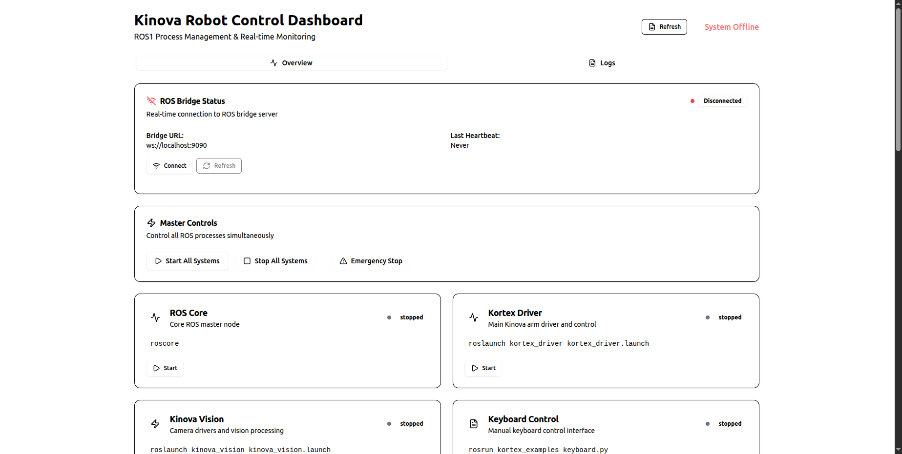 |  |
|:--------------------------------------------:|:-----------------------------------------------:|
| *System Overview*                            | *Web Dashboard*                                 |

|  |  |
|:-----------------------------------------------:|:-----------------------------------------:|
| *Physical Robot Setup*                          | *ROS Node Graph*                          |

### 🎯 Key Capabilities

- **Dual Control Interfaces**: Web dashboard + Xbox controller
- **Real-time Communication**: WebSocket bridge between web and ROS
- **Safety First**: Emergency stops, collision detection, joint limits  
- **Process Management**: Start/stop ROS services from web interface
- **Live Monitoring**: Real-time robot status, joint states, camera feeds
- **Motion Planning**: MoveIt integration for advanced path planning
- **Servo Control**: Real-time velocity control with smooth motion

## 🏗️ Complete System Architecture

### High-Level System Flow

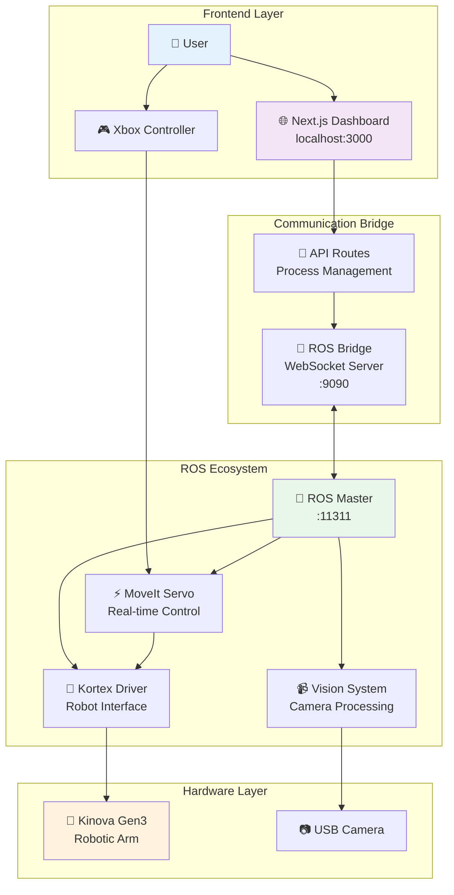

### Detailed Data Flow

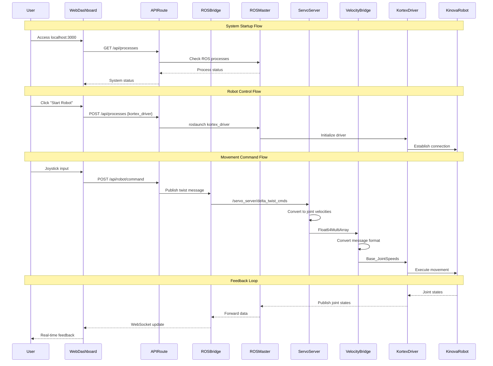

### Message Flow Architecture

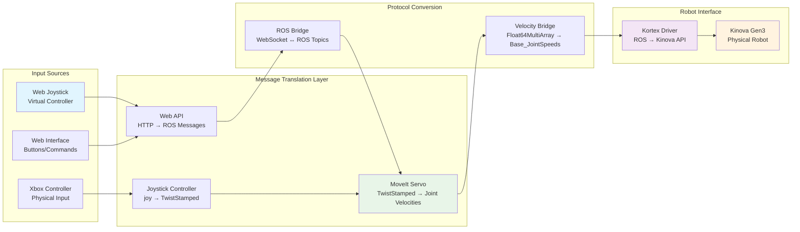

### Process Dependency Graph

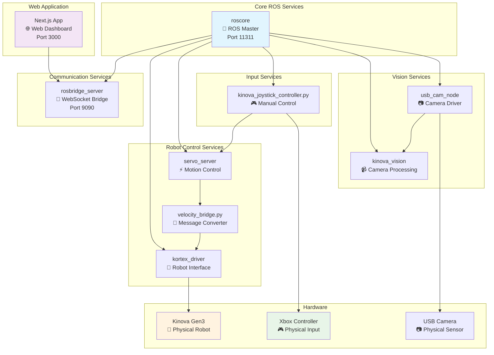

## 🚀 Quick Start Guide

### Prerequisites
- Ubuntu 20.04.6 LTS
- ROS Noetic
- Node.js 18+
- Kinova Gen3 robotic arm
- Xbox controller (optional)

### One-Command Setup

```bash
# Clone and setup everything
git clone https://github.com/Team-Deimos-IIT-Mandi/Robotic-Arm-Gui
cd my_main_project

# Run automated setup
./scripts/quick-setup.sh

# Start the system
npm run start-system
```

### Manual Setup Process

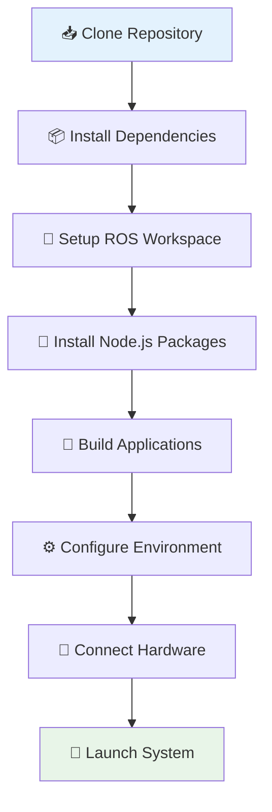

### System Startup Sequence

```bash
# 1. Start ROS Core (Required first)
roscore &

# 2. Start Robot Driver
roslaunch kortex_driver kortex_driver.launch &

# 3. Start Communication Bridge  
roslaunch rosbridge_server rosbridge_websocket.launch port:=9090 &

# 4. Start Motion Control
roslaunch kortex_examples servo.launch &
python3 scripts/velocity_bridge.py &

# 5. Start Web Application
npm run dev &

# 6. Optional: Start Manual Control
python3 scripts/kinova_joystick_controller.py &
```

## 🎛️ Control Interfaces

### Web Dashboard Features

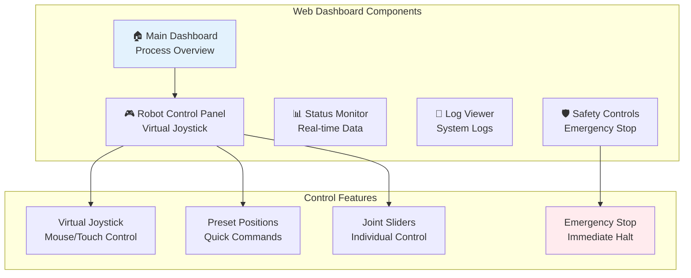

### Physical Controller Mapping

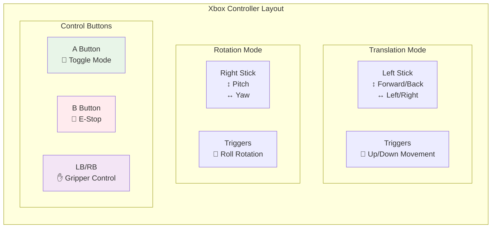

## 📂 Project Structure & Documentation

```
my_main_project/
├── 📁 my-app/                       # Next.js Web Application
│   ├── 📄 README.md                 # 🔗 Web App Documentation
│   ├── 📁 app/
│   │   ├── 📁 api/                  # API Route handlers
│   │   └── 📄 page.tsx              # Main dashboard
│   ├── 📁 components/
│   │   ├── 📁 kinova/               # Robot-specific UI
│   │   └── 📁 ui/                   # Reusable components  
│   └── 📁 lib/
│       └── 📄 rosbridge.ts          # ROS WebSocket client
├── 📁 ros_ws/                       # ROS Workspace
│   ├── 📄 README.md                 # 🔗 ROS Documentation
│   └── 📁 src/
│       └── 📁 niwesh/kinova_urc_arm/
│           └── 📁 kortex_examples/
│               ├── 📁 config/       # Robot configurations
│               ├── 📁 launch/       # ROS launch files
│               └── 📁 scripts/      # Control scripts
├── 📄 README.md                     # 📖 This main documentation
└── 📁 docs/                         # Additional documentation
    ├── 📄 INSTALLATION.md           # 🔗 Detailed setup guide
    ├── 📄 TROUBLESHOOTING.md        # 🔗 Problem solving
    └── 📄 API_REFERENCE.md          # 🔗 API documentation
```

## 🔗 Detailed Documentation Links

| Component | Documentation | Description |
|-----------|---------------|-------------|
| **Web Dashboard** | [📱 my-app/README.md](./my-app/README.md) | Next.js application setup, components, and API routes |
| **ROS System** | [🤖 ros_ws/README.md](./ros_ws/README.md) | ROS nodes, topics, services, and configurations |
| **Installation** | [⚙️ docs/INSTALLATION.md](./docs/INSTALLATION.md) | Step-by-step installation and setup |
| **Troubleshooting** | [🔧 docs/TROUBLESHOOTING.md](./docs/TROUBLESHOOTING.md) | Common issues and solutions |
| **API Reference** | [📚 docs/API_REFERENCE.md](./docs/API_REFERENCE.md) | Complete API documentation |

## 🛠️ Development Workflow

### For Web Developers

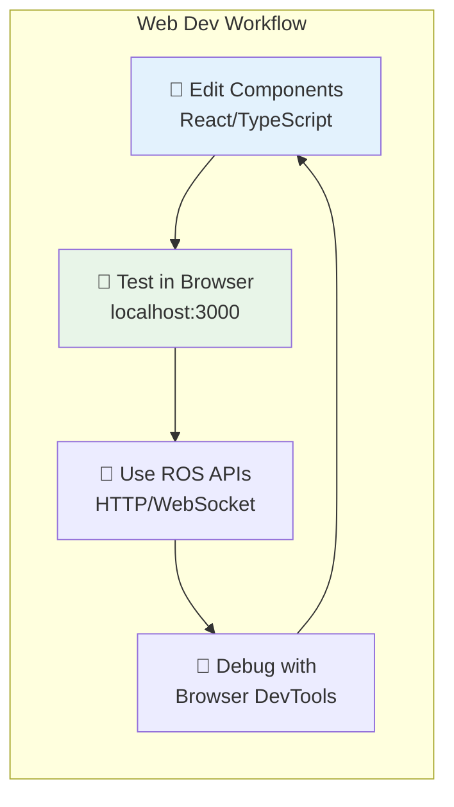

### For Robotics Developers

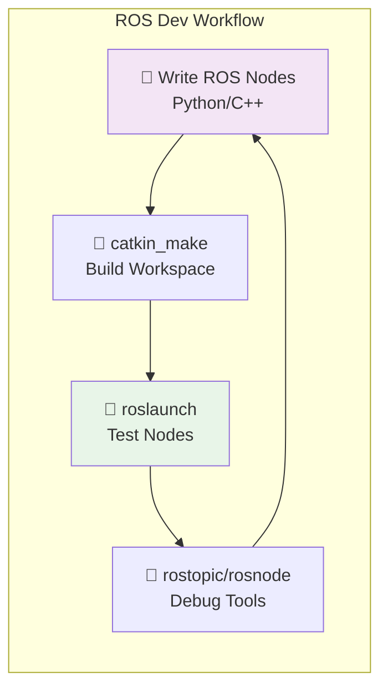

## 🚦 System Status Indicators

The system provides comprehensive status monitoring:

### Web Dashboard Status

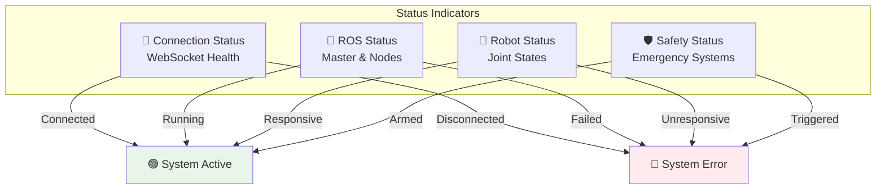

## 🔒 Safety Systems

### Multi-Layer Safety Architecture

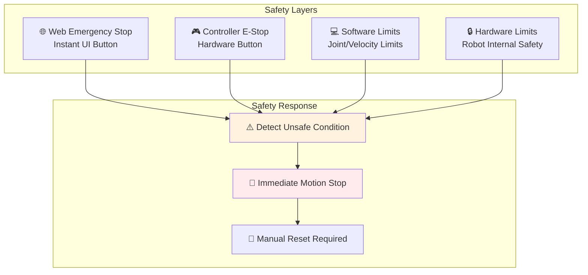

## 📊 System Monitoring

### Real-time Metrics

- **🔄 Update Rate**: 50Hz servo control, 30Hz web updates
- **⚡ Latency**: <50ms web to robot command
- **📡 Communication**: WebSocket + ROS topics
- **🛡️ Safety**: <10ms emergency stop response

### Key Topics for Monitoring

```bash
# Robot state
/my_gen3/joint_states          # Current joint positions/velocities
/my_gen3/base_feedback         # Robot base status

# Control commands  
/servo_server/delta_twist_cmds # Cartesian velocity commands
/my_gen3/in/joint_velocity     # Joint velocity commands

# System status
/servo_server/status           # Servo system status
/rosout                        # System log messages
```

## 🤝 Contributing

We welcome contributions from both web developers and robotics engineers!

### Contribution Areas

- **🌐 Frontend**: React components, UI/UX improvements
- **📡 Backend**: API endpoints, WebSocket handling  
- **🤖 ROS**: New robot capabilities, safety features
- **📚 Documentation**: Tutorials, examples, guides
- **🧪 Testing**: Unit tests, integration tests
- **🐛 Bug Fixes**: Issue resolution, performance optimization

### Development Setup

```bash
# Fork and clone
git clone https://github.com/your-username/Robotic-Arm-Gui
cd my_main_project

# Setup development environment
./scripts/dev-setup.sh

# Create feature branch
git checkout -b feature/your-amazing-feature

# Make changes and test
npm run dev        # Test web changes
catkin_make        # Test ROS changes

# Submit PR
git push origin feature/your-amazing-feature
```

## 📞 Support & Community

- **🐛 Issues**: [GitHub Issues](https://github.com/Team-Deimos-IIT-Mandi/Robotic-Arm-Gui/issues)
- **💬 Discussions**: [GitHub Discussions](https://github.com/Team-Deimos-IIT-Mandi/Robotic-Arm-Gui/discussions)
- **📖 ROS Help**: [ROS Answers](https://answers.ros.org/)
- **📚 Kinova Docs**: [Official Documentation](https://github.com/Kinovarobotics/ros_kortex)

## 📄 License

This project is licensed under the MIT License - see the [LICENSE](LICENSE) file for details.

---

**⚠️ Safety Notice**: This system controls physical robotic hardware. Always ensure proper safety measures are in place, including emergency stops, workspace barriers, and trained operators. Never operate the robot in an unsafe environment or without proper supervision.

**🎯 Mission**: Bridging the gap between web development and robotics, making advanced robotic control accessible to developers from all backgrounds.