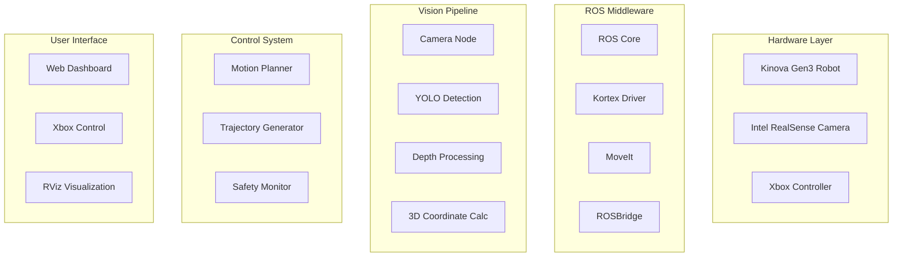
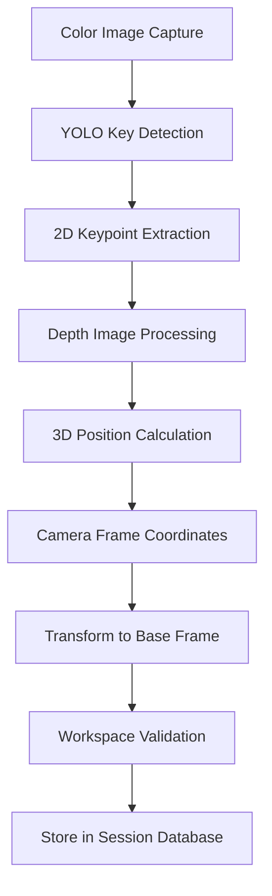
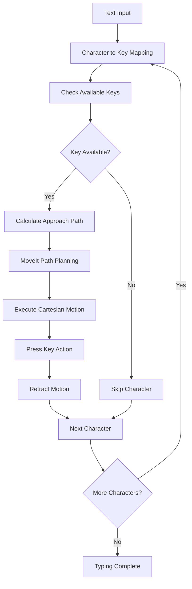
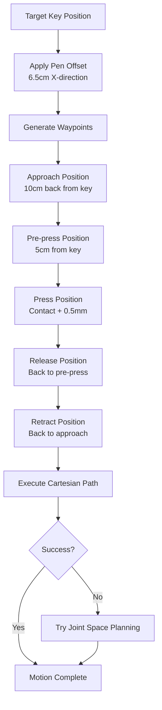

# 🤖 Kinova Gen3 Robotic Typing System
### 🎥 Demo Videos

> A comprehensive ROS-based system that enables a Kinova Gen3 robotic arm to autonomously detect keyboards using computer vision and perform precise typing tasks with integrated web dashboard control.

| Typing "gfcvb" | Typing "12345678" |
| :---: | :---: |
| [](https://youtu.be/coct-xELX2Y) | [](https://youtu.be/puK2aN-aQQY) |

## 📋 Table of Contents

- [Project Overview](#-project-overview)
- [Features](#-features)
- [System Architecture](#️-system-architecture)
- [System Flow](#-system-flow)
- [Installation](#️-installation)
- [Usage](#-usage)
- [Project Structure](#-project-structure)
- [Configuration](#-configuration)
- [Xbox Controller Integration](#-xbox-controller-integration)
- [Web Dashboard](#-web-dashboard)
- [Demo Video](#-demo-video)
- [Contributing](#-contributing)

## 🎯 Project Overview

This project combines computer vision, robotics, and web technologies to create an intelligent typing robot. The system uses **YOLO-based object detection** to identify keyboard keys, calculates their 3D positions using depth sensing, and executes precise typing motions through **MoveIt** motion planning.

### Key Components:

-   **Vision System**: YOLO v8 model for keyboard key detection.
-   **Motion Planning**: MoveIt integration for safe robotic movements.
-   **Web Interface**: Real-time dashboard for monitoring and control.
-   **Controller Support**: Xbox controller integration for manual teleoperation.

## ✨ Features

-   **🔍 Real-time Keyboard Detection**: YOLO-based key identification.
-   **📐 3D Position Calculation**: Depth camera integration for spatial awareness.
-   **🎯 Precision Typing**: Sub-millimeter accuracy for key pressing.
-   **🛡️ Safety Systems**: Collision avoidance and workspace constraints.
-   **🌐 Web Dashboard**: Real-time monitoring and control interface.
-   **🎮 Manual Control**: Xbox controller integration for teleoperation.
-   **📊 Live Visualization**: RViz integration for robot state monitoring.

## 🏗️ System Architecture

    
## 📊 System Flow
### 1. Vision Processing Flow

### 2. Typing Execution Flow

### 3. Motion Planning Logic


## ⚙️ Installation

### Clone and Build

```bash
# Create and navigate to your ROS workspace source directory
mkdir -p ~/ros_ws/src
cd ~/ros_ws/src

# Clone the repository
git clone https://github.com/your-username/kinova-typing-robot.git

# Install required Python packages
pip3 install ultralytics opencv-python torch torchvision

# Build the workspace
cd ~/ros_ws
catkin_make

# Source the workspace to your shell environment
echo "source ~/ros_ws/devel/setup.bash" >> ~/.bashrc
source ~/.bashrc
```

## 🚀 Usage

1.  **Start the Robot Driver (Terminal 1)**
    Update the `ip_address` to match your robot's IP.

    ```bash
    roslaunch kortex_driver kortex_driver.launch ip_address:=192.168.1.10
    ```

2.  **Launch the Vision System (Terminal 2)**
    Start the vision processing node to enable keyboard key detection.

    ```bash
    roslaunch kinova_vision kinova_vision.launch
    ```

3.  **Launch the Typing Controller (Terminal 3)**
    Start the motion control node for typing execution.

    ```bash
    roslaunch kortex_examples typing_controller.launch
    ```

3.  **Send a Typing Command (Terminal 3)**
    Publish a string to the `/typing_command` topic to make the robot type.

    ```bash
    rostopic pub /typing_command std_msgs/String "data: 'Hello World'"
    ```

4.  **(Optional) Visualize Camera Feed**
    Use `rqt_image_view` to see what the robot's camera sees.

    ```bash
    rosrun rqt_image_view rqt_image_view
    ```

## 🤝 Contributing
We welcome contributions! Please see our Contributing Guidelines for details.

### Development Setup
### Key Areas for Contribution
- 🎯 **Vision Improvements**: Better key detection models
- 🤖 **Motion Optimization**: Faster, more precise movements
- 🌐 **UI Enhancements**: Dashboard features and usability
- 📱 **Mobile Support**: Smartphone control interface
- 🧪 **Testing**: Unit tests and integration tests

## 📄 License
This project is licensed under the MIT License - see the LICENSE file for details.

## 🙏 Acknowledgments
- Kinova Robotics for the Gen3 robot platform
- Ultralytics for YOLO object detection
- MoveIt community for motion planning tools
- ROS community for the middleware framework

Built with ❤️ for robotics automation 